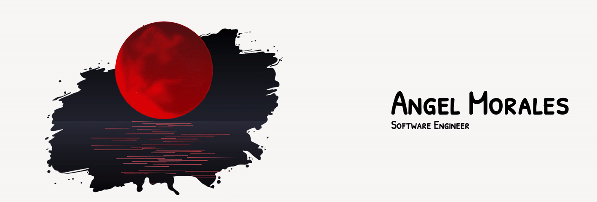

## Hello  👨🏽‍💻👩‍💻! My name is Angel 
### I'm currently...
- 🧞 Software Engineer at Floreo Labs
- 🧙 Tech Advisor at Lehman College
- 🦸‍♂️Web Developer Instructor at Hunter College

#

Github Stats

 

<h4>Technologies</h4>

 

 

 

 

 
 
 
 

#
